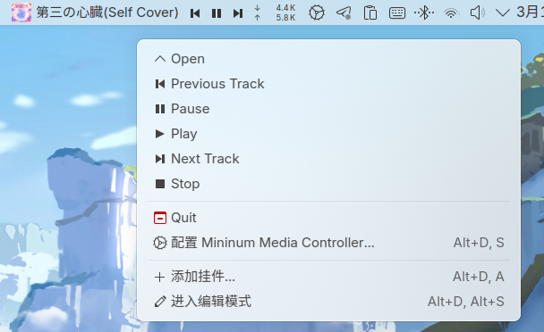

# Minimum Media Controller

This widget is a fork of Plasma's built-in media contoller widget, providing a minimim media info & controller bar for Plasma 6.

It refers to [mediacontroller_plus](https://github.com/ismailof/mediacontroller_plus) and [kde-currently-playing](https://github.com/JunoNgx/kde-currently-playing).

### Features

- Playback controllers
- Custom font size & layout height

### What's not supported

- Full representation.

  for full representation, please use the built-in media controller widget.

### Screenshot



### Install

```bash
cp -r plasmoid ~/.local/share/plasma/plasmoids/ink.chyk.minimumMediaController
systemctl restart --user plasma-plasmashell.service
```

### Uninstall

```bash
rm -rf ~/.local/share/plasma/plasmoids/ink.chyk.minimumMediaController
systemctl restart --user plasma-plasmashell.service
```

